```mermaid
erDiagram

    %% ══════════════════════════════════════════════════════════
    %% CORE PIPELINE ENTITIES
    %% ══════════════════════════════════════════════════════════

    IOC {
        string  ioc_raw             "Exact string from analyst input"
        string  ioc_clean           "Normalised: lowercase domain, uppercase hash, lowercase eco prefix"
        string  ioc_type            "ip | domain | url | hash_md5 | hash_sha1 | hash_sha256 | cve | package | package_multi | unknown"
    }

    TRIAGE_RUN {
        string   run_id             "UUID generated at graph entry"
        datetime started_at         "Timestamp when input_node executed"
        datetime completed_at       "Timestamp when report_node completed"
        float    total_duration_ms  "Wall-clock time for full pipeline"
        bool     escalation_required "True if severity_band == CRITICAL"
    }

    AGENT_STATE {
        string  ioc_raw                "Mirrors IOC.ioc_raw — LangGraph shared state"
        string  ioc_clean              "Mirrors IOC.ioc_clean"
        string  ioc_type               "Mirrors IOC.ioc_type (9 types + unknown)"
        dict    raw_intel              "Per-source parsed API response dicts"
        list    intel_errors           "Non-fatal error strings from failed sources"
        dict    score_breakdown        "Per-source normalised 0.0-1.0 scores"
        float   composite_score        "Weighted aggregate 0.0–1.0"
        dict    active_weights         "Re-normalised weights after source redistribution"
        string  severity_band          "CLEAN | LOW | MEDIUM | HIGH | CRITICAL"
        string  verdict_justification  "Plain-English explanation of verdict"
        bool    escalation_required    "Routes to escalation_gate if true"
        string  report_text            "CLI-formatted threat report"
        string  report_html            "Styled HTML report for Jupyter"
        string  trace_endpoint         "OTLP endpoint where this run's spans were exported"
    }

    %% ══════════════════════════════════════════════════════════
    %% THREAT INTELLIGENCE ENTITIES
    %% ══════════════════════════════════════════════════════════

    THREAT_INTEL_SOURCE {
        string  source_name         "virustotal | abuseipdb | otx | urlscan | nvd | osv | osv_multi | registry"
        string  base_url            "API root URL"
        string  api_version         "v3 | v2 | v1 | 2.0 | REST"
        string  auth_type           "header_key | none"
        string  env_key_name        "e.g. VIRUSTOTAL_API_KEY or none"
        string  applicable_ioc_types "Comma-sep types this source is queried for"
    }

    THREAT_INTEL_RESULT {
        string  source_name         "FK to THREAT_INTEL_SOURCE"
        string  status              "success | error | unavailable"
        json    raw_response        "Full parsed API response dict"
        float   latency_ms          "Time from request to parsed response"
        string  error_message       "Populated only when status == error"
    }

    SCORE_COMPONENT {
        string  source_name         "FK to THREAT_INTEL_SOURCE"
        float   raw_signal          "Source-specific pre-normalisation value"
        float   normalised_score    "0.0 (clean) to 1.0 (malicious)"
        float   active_weight       "Re-normalised weight after source redistribution"
        float   weighted_contribution "normalised_score x active_weight"
    }

    %% ══════════════════════════════════════════════════════════
    %% SCORING & VERDICT ENTITIES
    %% ══════════════════════════════════════════════════════════

    WEIGHT_CONFIG {
        string  config_name         "BASE_WEIGHTS | CVE_WEIGHTS | PACKAGE_WEIGHTS | PACKAGE_MULTI_WEIGHTS"
        string  applicable_ioc_types "ip,domain,url,hash | cve | package | package_multi"
        string  source_name         "FK to THREAT_INTEL_SOURCE"
        float   base_weight         "Declared weight before redistribution"
    }

    SEVERITY_BAND {
        string  band                "CLEAN | LOW | MEDIUM | HIGH | CRITICAL"
        float   score_min           "Lower bound (inclusive)"
        float   score_max           "Upper bound (inclusive)"
        string  emoji               "green | yellow | orange | red | dark-red"
        string  analyst_guidance    "Recommended action for this band"
        bool    triggers_escalation "True only for CRITICAL"
    }

    COMPOSITE_SCORE {
        float   value               "Final weighted average 0.0-1.0"
        int     sources_used        "Count of sources that returned success"
        int     sources_failed      "Count of sources in intel_errors"
        bool    weights_redistributed "True if any source was absent"
    }

    CONFLICT_SIGNAL {
        string  source_a            "Source scoring clean lte 0.20"
        float   score_a             "Normalised score of source_a"
        string  source_b            "Source scoring bad gte 0.50"
        float   score_b             "Normalised score of source_b"
        string  description         "Human-readable conflict warning"
    }

    %% ══════════════════════════════════════════════════════════
    %% OUTPUT ENTITIES
    %% ══════════════════════════════════════════════════════════

    THREAT_REPORT {
        string  tldr_summary        "One-sentence summary at top of report"
        datetime timestamp          "UTC time when report was generated"
        string  report_text         "CLI plain-text formatted report"
        string  report_html         "Styled HTML for Jupyter output"
        string  severity_badge_color "CSS colour hex for severity"
        string  recommended_actions  "Band-specific next steps"
        list    detection_names     "AV engine names for hash IOCs or null"
        list    otx_campaigns       "Threat actor names and campaign tags or null"
        string  cvss_severity       "NVD severity string for CVE IOCs or null"
        dict    ecosystem_breakdown "Per-ecosystem results for package_multi or null"
        string  data_confidence     "X of Y sources responded or null"
    }

    ESCALATION_EVENT {
        string  run_id              "FK to TRIAGE_RUN"
        string  severity_band       "Always CRITICAL when this entity exists"
        float   composite_score     "Score that triggered escalation"
        string  runtime_env         "cli | jupyter | non_interactive"
        string  analyst_response    "yes | abort | auto_proceed"
        datetime prompted_at        "When analyst was prompted"
        datetime responded_at       "When analyst responded or auto-proceeded"
    }

    %% ══════════════════════════════════════════════════════════
    %% OBSERVABILITY ENTITIES
    %% ══════════════════════════════════════════════════════════

    OTEL_TRACE {
        string   trace_id           "OTLP trace ID"
        string   service_name       "flowrun-streamlet-ioc-triage (resource attribute)"
        datetime exported_at        "When trace was shipped via OTLP/HTTP"
        string   otlp_endpoint      "Resolved OTLP destination, e.g. http://localhost:4318"
    }

    OTEL_SPAN {
        string  span_id             "OTLP span ID"
        string  parent_span_id      "Null for root span"
        string  span_name           "flowrun.triage | flowrun.classify | langchain.tool | flowrun.correlate | flowrun.severity"
        string  span_type           "chain | llm | tool | custom"
        float   latency_ms          "Span duration"
        json    attributes          "OpenTelemetry span attributes"
        string  status              "ok | error"
    }

    SPAN_ATTRIBUTE {
        string  span_id             "FK to OTEL_SPAN"
        string  attribute_key       "e.g. ioc.type, tool.name, composite.score"
        string  attribute_value     "Serialised value"
        string  attribute_type      "string | float | bool | json"
    }

    %% ══════════════════════════════════════════════════════════
    %% LLM CONFIGURATION ENTITIES
    %% ══════════════════════════════════════════════════════════

    MODEL_CONFIG {
        string  task_name           "classifier | report"
        string  model_string        "gpt-4o-mini | gpt-4o"
        float   temperature         "0.0 for classifier, 0.3 for report"
        string  description         "Human-readable purpose of this config"
    }

    LLM_CALL {
        string  task_name           "FK to MODEL_CONFIG"
        string  model_string        "Actual model used (from MODEL_CONFIG)"
        int     prompt_tokens       "Input token count"
        int     completion_tokens   "Output token count"
        float   latency_ms          "Time to first token + generation"
        string  finish_reason       "stop | length | content_filter"
    }

    %% ══════════════════════════════════════════════════════════
    %% CREDENTIAL ENTITY
    %% ══════════════════════════════════════════════════════════

    API_CREDENTIAL {
        string  key_name            "e.g. VIRUSTOTAL_API_KEY or none for open APIs"
        string  resolution_method   "dotenv | os_environ | getpass | not_required"
        bool    resolved            "True if value found during startup"
        string  masked_hint         "First 4 chars + *** or N/A for open APIs"
    }

    %% ══════════════════════════════════════════════════════════
    %% PACKAGE-SPECIFIC ENTITIES
    %% ══════════════════════════════════════════════════════════

    PACKAGE_ECOSYSTEM {
        string  user_prefix         "npm | pypi | rhel | debian | alpine | etc."
        string  osv_ecosystem       "npm | PyPI | Red Hat | Debian | etc."
        bool    has_registry        "True only for npm and pypi"
        bool    in_multi_scan       "True if scanned for bare package names"
    }

    %% ══════════════════════════════════════════════════════════
    %% RELATIONSHIPS
    %% ══════════════════════════════════════════════════════════

    %% A single IOC is investigated in one triage run
    IOC                 ||--||  TRIAGE_RUN          : "is investigated in"

    %% The triage run populates the shared agent state
    TRIAGE_RUN          ||--||  AGENT_STATE         : "populates"

    %% Each triage run queries multiple intelligence sources
    TRIAGE_RUN          ||--o{  THREAT_INTEL_RESULT  : "produces results from"

    %% Each result comes from exactly one source
    THREAT_INTEL_SOURCE ||--o{  THREAT_INTEL_RESULT  : "provides"

    %% Each source contributes one score component per run
    THREAT_INTEL_RESULT ||--||  SCORE_COMPONENT     : "is normalised into"

    %% Score components are governed by a weight config
    WEIGHT_CONFIG       ||--o{  SCORE_COMPONENT     : "governs weight of"

    %% Score components aggregate into one composite score
    SCORE_COMPONENT     }o--||  COMPOSITE_SCORE     : "aggregates into"

    %% Composite score maps to exactly one severity band
    COMPOSITE_SCORE     ||--||  SEVERITY_BAND       : "maps to"

    %% Scoring may detect conflicting signals between sources
    COMPOSITE_SCORE     ||--o{  CONFLICT_SIGNAL     : "may detect"

    %% Severity band drives the threat report
    SEVERITY_BAND       ||--||  THREAT_REPORT       : "drives content of"

    %% Conflict signals appear as callouts in the report
    CONFLICT_SIGNAL     }o--||  THREAT_REPORT       : "highlighted in"

    %% CRITICAL severity triggers an escalation event
    SEVERITY_BAND       ||--o|  ESCALATION_EVENT    : "may trigger"

    %% Triage run produces one threat report
    TRIAGE_RUN          ||--||  THREAT_REPORT       : "outputs"

    %% Each triage run emits one OpenTelemetry trace
    TRIAGE_RUN          ||--||  OTEL_TRACE          : "is observed by"

    %% OTEL trace contains multiple spans
    OTEL_TRACE          ||--o{  OTEL_SPAN           : "contains"

    %% Each span has multiple attributes
    OTEL_SPAN           ||--o{  SPAN_ATTRIBUTE      : "carries"

    %% Each triage run uses up to two LLM calls (classifier may be skipped by regex)
    TRIAGE_RUN          ||--o{  LLM_CALL            : "makes"

    %% Each LLM call is governed by a model config
    MODEL_CONFIG        ||--o{  LLM_CALL            : "configures"

    %% Each threat intel source may require one credential (or none for open APIs)
    THREAT_INTEL_SOURCE ||--o|  API_CREDENTIAL      : "authenticated by"

    %% IOC type determines which weight config is used
    IOC                 ||--||  WEIGHT_CONFIG       : "selects"

    %% Package IOCs reference an ecosystem for OSV.dev queries
    IOC                 }o--o|  PACKAGE_ECOSYSTEM   : "may reference"

    %% OSV and Registry tools use the ecosystem map
    THREAT_INTEL_SOURCE }o--o{  PACKAGE_ECOSYSTEM   : "queries via"
```

# FlowRun Streamlet: IoC Triage — Entity Relationship Diagram

> Rendered automatically by GitHub via [Mermaid](https://mermaid.js.org/).  
> Every entity maps to a data structure in the live agent pipeline (v0.0.33).  
> Relationships reflect how data flows through the LangGraph `AgentState` and its downstream consumers.

---

---

## Entity Reference

### Core Pipeline

| Entity | Maps To | Description |
|---|---|---|
| `IOC` | `AgentState.ioc_*` fields | The raw and normalised input artifact being triaged. 9 types: ip, domain, url, hash_md5, hash_sha1, hash_sha256, cve, package, package_multi |
| `TRIAGE_RUN` | One graph invocation | A single end-to-end execution of the LangGraph pipeline |
| `AGENT_STATE` | `agent/state.py AgentState` | The shared TypedDict (14 fields) passed between all LangGraph nodes |

### Threat Intelligence

| Entity | Maps To | Description |
|---|---|---|
| `THREAT_INTEL_SOURCE` | `agent/tools/*.py` | One of the 8 configured threat intelligence tools (VT, AbuseIPDB, OTX, urlscan, NVD, OSV, OSV multi, Registry) |
| `THREAT_INTEL_RESULT` | `AgentState.raw_intel[source]` | Raw parsed response from a single source for one run |
| `SCORE_COMPONENT` | `AgentState.score_breakdown[source]` | Per-source normalised score and active weight |

### Scoring & Verdict

| Entity | Maps To | Description |
|---|---|---|
| `WEIGHT_CONFIG` | `BASE_WEIGHTS` / `CVE_WEIGHTS` / `PACKAGE_WEIGHTS` / `PACKAGE_MULTI_WEIGHTS` in `agent/scoring.py` | Declared weights per source; 4 configs for different IOC categories |
| `COMPOSITE_SCORE` | `AgentState.composite_score` | Single float 0.0–1.0 aggregated from all score components |
| `SEVERITY_BAND` | `AgentState.severity_band` | One of five verdict tiers; CRITICAL triggers escalation |
| `CONFLICT_SIGNAL` | `detect_conflicts()` in `agent/scoring.py` | Warning when one source reports clean but another shows threat signals |

### Output

| Entity | Maps To | Description |
|---|---|---|
| `THREAT_REPORT` | `AgentState.report_text` / `report_html` | Formatted output with TL;DR, timestamp, detection names, conflict callouts, per-ecosystem breakdown |
| `ESCALATION_EVENT` | `escalation_gate` node | Human-in-the-loop pause for CRITICAL. CLI: input(). Jupyter: auto-proceed with warning. |

### Observability

| Entity | Maps To | Description |
|---|---|---|
| `OTEL_TRACE` | One OpenTelemetry trace | Root trace created per run via the Traceloop SDK (OpenLLMetry) and exported via OTLP/HTTP. Default destination `http://localhost:4318`. |
| `OTEL_SPAN` | Individual spans | Auto-instrumented (LangChain/LangGraph/OpenAI by Traceloop) + custom spans (`flowrun.correlate`, `flowrun.severity`) emitted via `opentelemetry.trace.get_tracer()` |
| `SPAN_ATTRIBUTE` | `span.set_attribute(key, value)` | OpenTelemetry-compliant attributes on each span |

### LLM Configuration

| Entity | Maps To | Description |
|---|---|---|
| `MODEL_CONFIG` | `MODEL_CONFIG` dict in `agent/llm.py` | Per-task model and temperature. GPT-4o-mini (classifier, temp=0.0) + GPT-4o (report, temp=0.3). |
| `LLM_CALL` | LLM spans in the OTLP trace | Up to 2 calls per run: classifier (may be skipped if regex resolves type) and report |

### Package Ecosystem

| Entity | Maps To | Description |
|---|---|---|
| `PACKAGE_ECOSYSTEM` | `ECOSYSTEM_MAP` in `agent/integrations/osv.py` | Maps 27 user prefixes to OSV ecosystem names. 10 included in multi-scan for bare package names. |

### Weight Config Quick Reference

| Config | Applies To | Sources & Weights |
|---|---|---|
| `BASE_WEIGHTS` | ip, domain, url, hash types | VirusTotal 0.40 · AbuseIPDB 0.30 · OTX 0.20 · urlscan 0.10 |
| `CVE_WEIGHTS` | `ioc_type == cve` only | OTX 0.40 · NIST NVD 0.60 |
| `PACKAGE_WEIGHTS` | `ioc_type == package` (prefixed) | OSV.dev 0.60 · Registry 0.40 |
| `PACKAGE_MULTI_WEIGHTS` | `ioc_type == package_multi` (bare name) | OSV.dev multi-scan 1.00 |

> ⚠️ Weights within each config always sum to **1.00**. Sources inapplicable to the detected IOC type are excluded and remaining weights are re-normalised proportionally before scoring.

### API Source Quick Reference

| Source | Base URL | Auth | IOC Types |
|---|---|---|---|
| VirusTotal v3 | `https://www.virustotal.com/api/v3` | VIRUSTOTAL_API_KEY | ip, domain, url, hash |
| AbuseIPDB v2 | `https://api.abuseipdb.com/api/v2/check` | ABUSEIPDB_API_KEY | ip |
| AlienVault OTX v1 | `https://otx.alienvault.com/api/v1/indicators` | OTX_API_KEY | ip, domain, url, hash, cve |
| urlscan.io v1 | `https://urlscan.io/api/v1/scan/` | URLSCAN_API_KEY | url, domain |
| NIST NVD 2.0 | `https://services.nvd.nist.gov/rest/json/cves/2.0` | None | cve |
| OSV.dev | `https://api.osv.dev/v1/query` | None | package |
| OSV.dev (multi) | `https://api.osv.dev/v1/query` (×10) | None | package_multi |
| npm Registry | `https://registry.npmjs.org/{pkg}` | None | package (npm) |
| PyPI JSON API | `https://pypi.org/pypi/{pkg}/json` | None | package (pypi) |

### Severity Band Reference

| Band | Score Range | Triggers Escalation |
|---|---|---|
| 🟢 CLEAN | 0.00 – 0.10 | No |
| 🟡 LOW | 0.11 – 0.30 | No |
| 🟠 MEDIUM | 0.31 – 0.55 | No |
| 🔴 HIGH | 0.56 – 0.75 | No |
| 🚨 CRITICAL | 0.76 – 1.00 | **Yes** — CLI: pauses for analyst confirmation. Jupyter: auto-proceeds with warning. |

---

*FlowRun Streamlet: IoC Triage · ERD v3 · LangGraph + LangChain + OpenAI GPT-4o + OpenTelemetry (Traceloop) · Reconciled with codebase v0.0.33*
